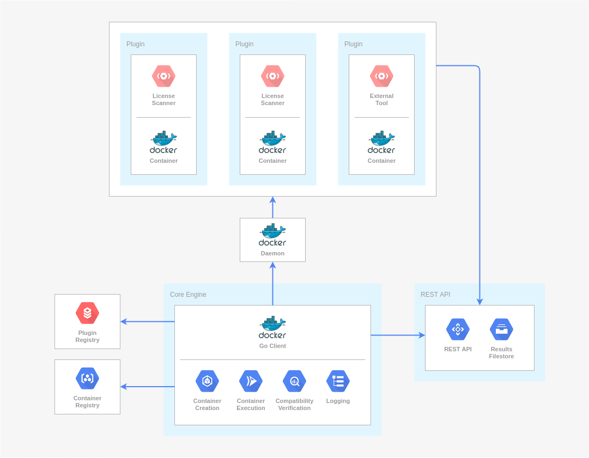

<!--
SPDX-FileCopyrightText: 2021 Cristian Mogildea

SPDX-License-Identifier: CC-BY-SA-4.0
-->

## Introduction

This package implements the plugin architecture in the client application as part of an ongoing master thesis at the Professorship for Open Source Software at the Friedrich-Alexander-University Erlangen-Nuremberg. The goal is to facilitate the integration of scanner tools which are defined as plugins.

## Architecture Overview



## How to Use

This README file contains information on how to use the plugin system, for the client application see README file in the root directory.

### Configuration

You can configure the core engine using the `core_engine_config.json` configuration file:
- Enable/disable REST API
- Authentication credentials
- Enable/disable option for saving result files locally
- Path to directory for saving result files (default: temp dir)
- Path to directory for saving log files (default: temp dir)

### Add a new plugin

A plugin consists of a Docker container that encapsulates a scanner tool. You need to ensure that the scanner tool can successfully operate inside the Docker container and must use `/input` path as input and save the result files to `/result` path. You need to specify following metadata of your plugin in the plugin registry configuration file: 
```yaml
name: ScannerTool   # Name of your scanner tool
version: 3.3.3      # Version
dockerimg: registry.example.com/path/to/scannertool:v3.3.3 # Image name/tag including registry hostname
shell: /bin/bash    # Shell inside container
cmd: scannertool -i /input/ -o /result/result.json # Command that executes the scanner tool
results:
  - result.json     # Name of result file (add more as needed)
```
#### Registry hostname

If you don't specify the registry hostname in the image name, Docker's local file system will be searched for that image.

#### Troubleshooting

In case your plugin doesn't provide expected results, check its corresponding log file after execution.

#### File formats

You can use both *YAML* or *JSON* file formats for your plugin registry configuration file. Use `-r` option and path to your configuration file as parameter. If you indicate `all` as parameter for `-s` option all plugins inside the plugin registry will be executed.

## Prerequisites

Depending on configuration following prerequisites may be necessary:

### curl command line tool for REST API

Your plugin must contain curl command line tool inside the Docker container to be able to communicate with the plugin system.

### Authentication for container repository

If authentication is necessary to retrieve Docker images from the specified container repository, you can indicate your username and password in the configuration file or by setting following environment variables:

- `REMOTEREPO_USER` your username
- `REMOTEREPO_PASS` your password or token (for *GitHub Packages*)

Note: For *GitHub Actions* workflows `GITHUB_TOKEN` is used and no further action is necessary.

## License

Copyright 2021 Cristian Mogildea

For license details see README file in the root directory.